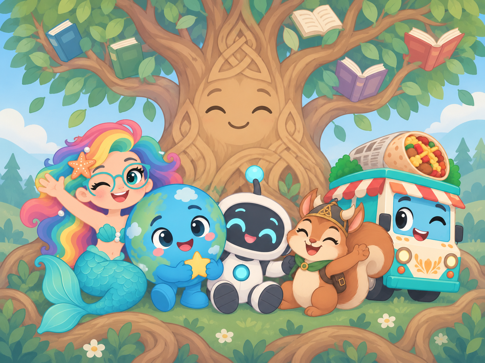

# Project Worlds


A personal operating environment. One core process with native
capabilities, a calm personal hub — **Overview · Memory · Chat ·
Settings**, where the daily loop of orient, remember, resume, and
discover begins on Overview — and an assistant that proposes but does
not act without approval.

**Stable truth. Replaceable machinery.** Your data stays on your own
hardware, portable and exportable. The durable core and the hub are
usable today in a **private technical alpha** — this is not a public
alpha, and not every visible surface is backed by live personal data;
parked surfaces are deliberately labelled specimen panels and never
pretend to be your data.

> **New here?** Run `./install.sh` and read
> **[docs/QUICKSTART.md](docs/QUICKSTART.md)** — one command, no config,
> written for tired and disabled people first.
> Direction: **[docs/TRUE-NORTH.md](docs/TRUE-NORTH.md)**.
> (The interface is the React app in `ui/` since the 2026-09-22 flip;
> the server-rendered Station was retired, kept as a theme package,
> never deleted. Historical port notes: [docs/PORTING.md](docs/PORTING.md).)

## What ships by default

A portable appliance: the core process plus Ollama (qwen3:1.7b) and a
one-shot model-bootstrap container, exactly what `compose.yaml` brings
up on `docker compose up -d`. No other containers are required.

**Surfaces, honestly wired.** Some hub surfaces read live personal
data, some are device-local by design, and some are deliberately
labelled specimen panels — they never pretend to be your data:

- **API-wired today.** Overview's daily loop reads live journal,
  proposals, and reminders (latest thread via `GET /api/journal/last`,
  API-084); Memory lists and finds your real journal entries and
  records (`GET /api/journal` + records search); Settings renders and
  writes your real stored preferences (`API-030/031`), including the
  voice/tone register and the optional residents pack (default off).
  `/login` and `/setup` are server-rendered.
- **Device-local by design.** Chat conversations stay on the device;
  the assistant's replies come from your configured model when one is
  present, and an honest `not_configured` when it is not.
- **Specimen / parked, on purpose.** Projects stays a parked surface
  with plainly labelled records; the Overview discovery sliver is
  labelled until it reads a real feed. `.project/CURRENT.md` records
  exactly what is wired today.

**10 native providers** (in-process, no extra containers):

| Provider | Purpose |
|---|---|
| `native_vault` | Secrets |
| `native_memory` | SQLite FTS5 search |
| `native_calendar` | ICS/CalDAV |
| `native_discovery` | Content discovery |
| `native_reconciler` | Settings validation |
| `native_lab` | Service inventory + health |
| `native_updates` | GitHub releases |
| `native_notifications` | Webhook/ntfy |
| `native_media` | Plex/Sonarr/Radarr/Lidarr |
| `native_deployment` | Docker Compose/systemd |

**Brain Template System:** 21 templates (4 core, 2 personas, 9
surfaces, 4 tasks, 2 formats), private overrides via
`config/prompts.local/`, provenance tracking.

**Connections & Providers:** provider wiring is schema-driven and
managed in `config/connections.json`; the in-process natives above
need no configuration at all.

**Brain tools** cover read-only world inspection, media, and
proposal-based writes — every write path needs your approval.

**Auth/SSO:** Native/local auth (`PW_API_TOKEN`), session-cookie support,
provider-neutral OIDC seam (`config/oidc.json` — point it at your own
IdP), step-up auth (300s window), break-glass (`PW_API_TOKEN`
fallback). OIDC-capable; deployed-provider status lives in private
operator documentation.

**Execution Viewer:** Bounded execution evidence with actor, target,
command, timestamps, and exit codes.

**Scheduler:** Background reminder runner, persistent across restarts.

## Architecture

```
Project Worlds core process
├── native_vault
├── native_memory
├── native_calendar
├── native_discovery
├── native_reconciler
├── native_lab
├── native_updates
├── native_notifications
├── native_media
├── native_deployment
├── journal
├── scheduler
├── tool registry
├── Brain Template System
├── proposal/approval system
└── Execution Viewer

Ollama
└── qwen3:1.7b default bundled brain
```

**One core process. Tiny native capabilities. Adapters to the outside
world. External services only when they earn their existence.**

## A Play-Nice product

This project adopts [Play-Nice Contracts](.project/contracts/adoption.yaml)
(`Rylee-Bee/play-nice-contracts`) as its shared cooperation and
engineering constitution.

Play-Nice governs how the four sides of Project Worlds cooperate:
**Rylee** (the owner), **Personal World** (the companion), the **agents
and models** that assist her, and the **providers, APIs, automation, and
interfaces** that orbit both of them. Truth and evidence, explicit state,
asking instead of guessing, provenance on consequential decisions,
recoverable mistakes, accessibility floors, bounded work, and
collaborative good faith are the cooperation floor — not the product.

Project Worlds **accepts and implements** the **full** Play-Nice
library (66 contracts across 8 layers) through one manifest:
[`.project/contracts/adoption.yaml`](.project/contracts/adoption.yaml),
pinned to library v0.7.0. Applicable contracts are resolved per task
from that manifest's `always` and `triggers` lists; no contract text is
copied into this repository. The explicit acknowledgement — target
revision, implemented contracts, and evidence — is in
[`ACKNOWLEDGEMENT.md`](ACKNOWLEDGEMENT.md).

The canonical adoption lives at
[`.project/contracts/adoption.yaml`](.project/contracts/adoption.yaml);
canonical current state at [`.project/CURRENT.md`](.project/CURRENT.md);
durable decisions at [`.project/DECISIONS.md`](.project/DECISIONS.md).

## The interface

The product UI is the **React rebuild** (`ui/`), served same-origin at
`/` by the backend. The container image builds it itself (node stage →
`src/personal_world/static/app/`); for a source checkout run
`bash scripts/build-app.sh`. `/login` and `/setup` are server-rendered.
The retired vanilla Station is no longer served or packaged; `/station`
and `/vnext` only redirect to `/`.

Sign-in is **provider-neutral OIDC** — point it at your own IdP
([docs/oidc.md](docs/oidc.md)). With an IdP configured the login page is
**passkey-first**: one "Sign in with …" button, and the access code folds
away as a fallback. The superseded React frontend was removed on
2026-09-16 (single-branch cutover).

### Screenshots

The Station-era screenshots under `docs/screenshots/` show the
retired server-rendered UI and are kept as history, not as the
current face. Current design truth is the Workshop v3 frame set and
pointers in [`.project/design/CURRENT.md`](.project/design/CURRENT.md);
the running interface is the React app in `ui/`.

## Quick start

Requires Python 3.12 or newer and [uv](https://docs.astral.sh/uv/getting-started/installation/).

```bash
git clone https://github.com/Rylee-Bee/personal-world.git
cd personal-world
uv sync --frozen --extra test
uv run personal-world --config-dir config.local init
uv run personal-world --config-dir config.local daily
```

Then serve the hub with a token:

```bash
PW_API_TOKEN=$(python3 -c "import secrets; print(secrets.token_urlsafe(32))") \
PW_CONFIG_DIR=config.local \
uv run uvicorn personal_world.api:create_app --factory --app-dir src --port 8000
```

`data/` and `config.local/` are ignored runtime directories. See
[Operations](docs/OPERATIONS.md) for container setup, tokens, and
network scope.

## Container deployment

```bash
export PW_API_TOKEN="$(python3 -c 'import secrets; print(secrets.token_urlsafe(32))')"
docker compose pull
docker compose up -d
```

The portable base image (`compose.yaml`) carries no host paths; it
boots with only the images, a `world-data` volume and an `ollama-data`
model volume, and the token — that is the core, Ollama, and the
one-shot model bootstrap. See
[Operations](docs/OPERATIONS.md#containers) for the full deployment
guide.

## How the assistant works

The brain receives a trimmed text snapshot of your world (capability
statuses, actors, intents, policies, world-classified lore, recent
journal events, source-repository summaries) plus the last six chat
turns. Private-class lore and secret material are never included.

- Read tools execute directly (inspect world status, search journal,
  check lab health, etc.)
- Write requests create bounded proposals (journal entries, world
  facts/intents, reminders)
- Chat is a real conversation when a model is configured — read-only:
  replies observe your world; no tool execution, no mutations without
  approval. No model configured answers an honest `not_configured`.
- Approval is required for all writes
- Step-up auth for consequential actions (300s window)
- Execution evidence is recorded in the Execution Viewer
- The brain does not receive arbitrary shell access

## Deeper documentation

| Interest | Entry point |
|---|---|
| Architecture | [ARCHITECTURE.md](docs/ARCHITECTURE.md) |
| Native baseline | [NATIVE-BASELINE-AND-ENRICHMENT.md](docs/NATIVE-BASELINE-AND-ENRICHMENT.md) |
| Operations | [OPERATIONS.md](docs/OPERATIONS.md) |
| Providers | [PROVIDERS.md](docs/PROVIDERS.md) |
| Direction | [TRUE-NORTH.md](docs/TRUE-NORTH.md) |
| Finish line detail | [PERSONAL-WORLD-FINISH-LINE.md](docs/PERSONAL-WORLD-FINISH-LINE.md) |
| Design | [Workshop v3 design authority](.project/design/CURRENT.md) |
| Accessibility | [ACCESSIBILITY_CONTRACT.md](docs/accessibility/ACCESSIBILITY_CONTRACT.md) |
| Full docs index | [INDEX.md](docs/INDEX.md) |
| Contributing | [CONTRIBUTING.md](CONTRIBUTING.md) |
| Security | [SECURITY.md](SECURITY.md) |

## Validation

```bash
uv run pytest --timeout=30
uv run personal-world framework validate --json
```

Licensed under [Apache-2.0](LICENSE). The project is experimental; see
the [security policy](SECURITY.md) for the current support and
deployment boundary.


