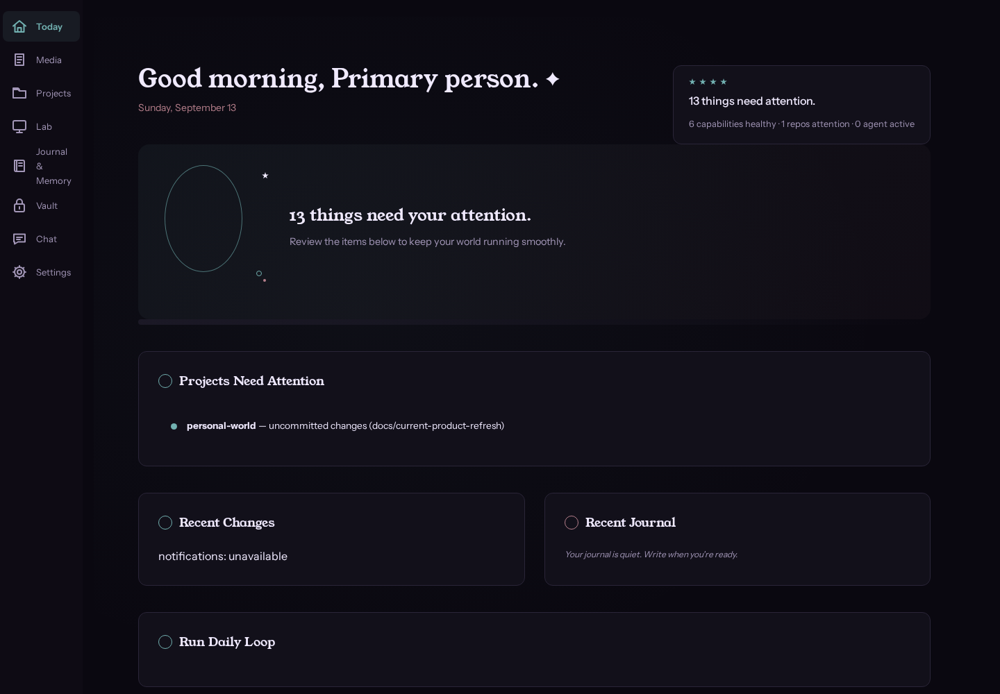
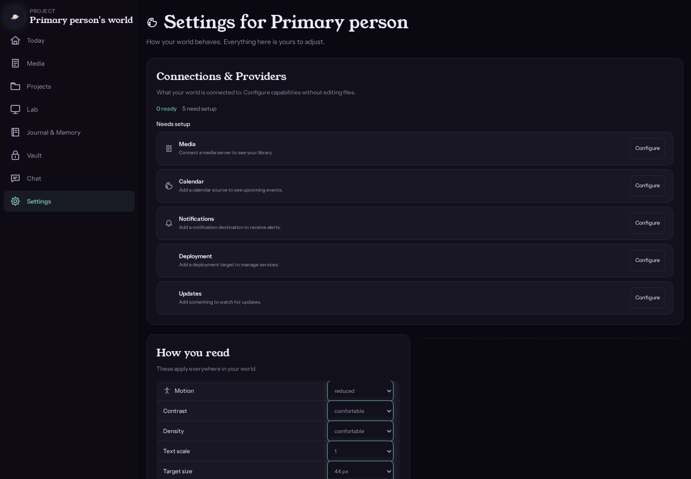
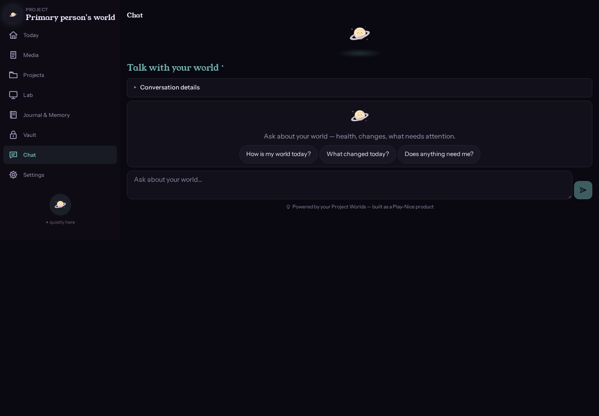
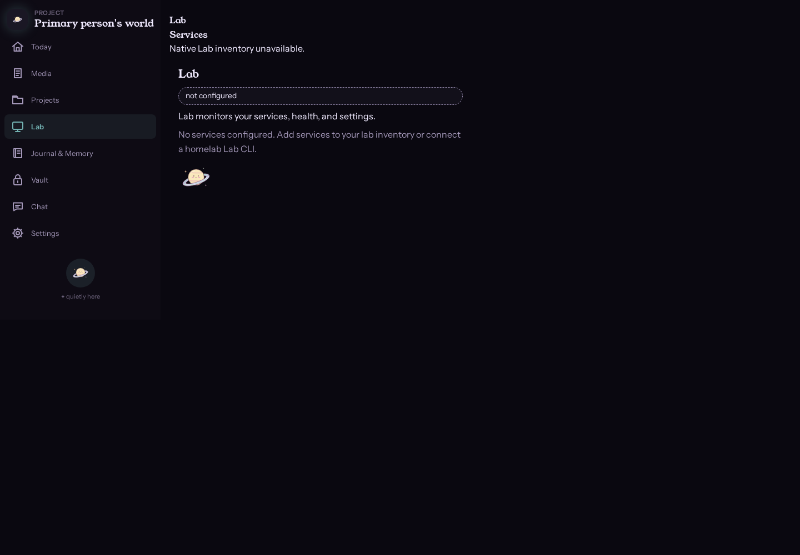
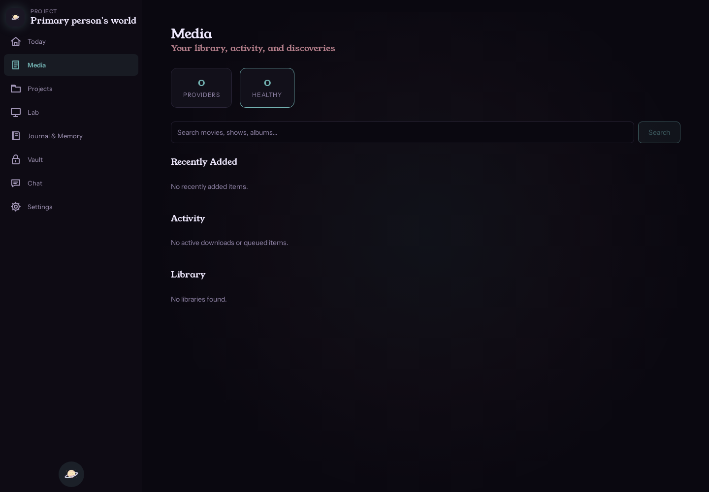
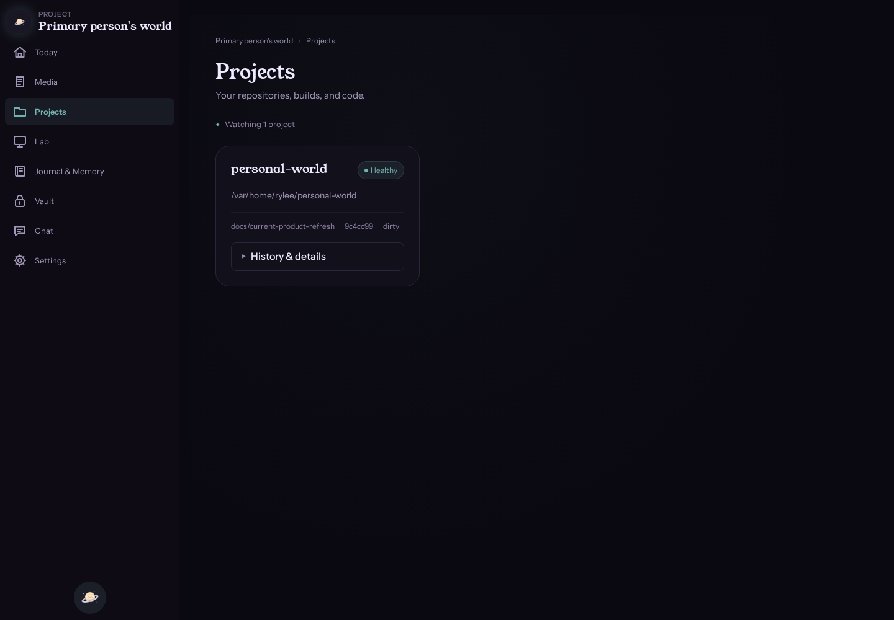

# Project Worlds

A personal operating environment. One core process with native
capabilities, a React frontend, and an AI assistant that proposes but
does not act without approval.

**Stable truth. Replaceable machinery.** Your data stays on your own
hardware, portable and exportable.

## What ships by default

One core process + Ollama (qwen3:1.7b). No other containers required.

**15 screens:** Today, Chat, Journal, Vault, World, Settings, Projects,
Lab, Interests, Media, and more — all wired to real API data.

**11 native providers** (in-process, no extra containers):

| Provider | Purpose |
|---|---|
| `native_git` | Source control |
| `native_vault` | Secrets |
| `native_memory` | SQLite FTS5 search |
| `native_calendar` | ICS/CalDAV |
| `native_discovery` | Content discovery |
| `native_reconciler` | Settings validation |
| `native_lab` | Service inventory + health |
| `native_updates` | GitHub releases |
| `native_notifications` | Webhook/ntfy |
| `native_media` | Plex/Sonarr/Radarr/Lidarr |
| `native_deployment` | Docker Compose/systemd |

**Brain Template System:** 19 templates (4 core, 9 surfaces, 4 tasks,
2 formats), private overrides via `config.prompts.local/`, provenance
tracking.

**Connections & Providers:** 7 capabilities, 18 provider schemas.
Configure providers from the UI without editing JSON files.

**29 brain tools:** 19 read tools + 4 media tools + 6 write tools
(proposal-based, require approval).

**Auth/SSO:** Native/local auth (`PW_API_TOKEN`), session-cookie support,
provider-neutral OIDC seam (`config/oidc.json`), step-up auth (300s
window), break-glass (`PW_API_TOKEN` fallback). Authelia-compatible /
implementation-ready — no live Authelia instance observed.

**Execution Viewer:** Bounded execution evidence with actor, target,
command, timestamps, and exit codes.

**Scheduler:** Background reminder runner, persistent across restarts.

## Architecture

```
Project Worlds core process
├── native_git
├── native_vault
├── native_memory
├── native_calendar
├── native_discovery
├── native_reconciler
├── native_lab
├── native_updates
├── native_notifications
├── native_media
├── native_deployment
├── journal
├── scheduler
├── tool registry
├── Brain Template System
├── proposal/approval system
└── Execution Viewer

Ollama
└── qwen3:1.7b default bundled brain
```

**One core process. Tiny native capabilities. Adapters to the outside
world. External services only when they earn their existence.**

## A Play-Nice product

This project adopts [Play-Nice Contracts](https://github.com/Rylee-Bee/play-nice-contracts)
as its shared cooperation and engineering constitution.

Play-Nice governs how the four sides of Project Worlds cooperate:
**Rylee** (the owner), **Personal World** (the companion), the **agents
and models** that assist her, and the **providers, APIs, automation, and
interfaces** that orbit both of them. Truth and evidence, explicit state,
asking instead of guessing, provenance on consequential decisions,
recoverable mistakes, accessibility floors, bounded work, and
collaborative good faith are the cooperation floor — not the product.

Play Nice integration: template-source registry exists, behavior pack
selection planned.

The canonical adoption lives at
[`.project/contracts/adoption.yaml`](.project/contracts/adoption.yaml);
canonical current state at [`.project/CURRENT.md`](.project/CURRENT.md);
durable decisions at [`.project/DECISIONS.md`](.project/DECISIONS.md).

## Screenshots

| | |
|---|---|
|  | Today — the calm daily overview |
|  | Connections — configure providers from the UI |
|  | Assistant — contextual chat with tool-calling |
|  | Lab — service inventory and health |
|  | Media — Plex/Sonarr/Radarr/Lidarr integration |
|  | Projects — local Git truth with optional GitHub enrichment |

[Full screenshot gallery →](docs/screenshots/INDEX.md)

## Quick start

Requires Python 3.12 or newer and [uv](https://docs.astral.sh/uv/getting-started/installation/).

```bash
git clone https://github.com/Rylee-Bee/personal-world.git
cd personal-world
uv sync --frozen --extra test
uv run personal-world --config-dir config.local init
uv run personal-world --config-dir config.local daily
```

Then serve the dashboard with a token:

```bash
PW_API_TOKEN=$(python -c "import secrets; print(secrets.token_urlsafe(32))") \
PW_CONFIG_DIR=config.local \
uv run uvicorn personal_world.api:create_app --factory --app-dir src --port 8000
```

`data/` and `config.local/` are ignored runtime directories. See
[Operations](docs/OPERATIONS.md) for container setup, tokens, and
network scope.

## Container deployment

```bash
export PW_API_TOKEN="$(python -c 'import secrets; print(secrets.token_urlsafe(32))')"
docker compose pull
docker compose up -d
```

The portable base image (`compose.yaml`) carries no host paths; it
boots with only the image, a `world-data` volume, and the token. See
[Operations](docs/OPERATIONS.md#containers) for the full deployment
guide.

## How the assistant works

The brain receives a trimmed text snapshot of your world (capability
statuses, actors, intents, policies, world-classified lore, recent
journal events, source-repository summaries) plus the last six chat
turns. Private-class lore and secret material are never included.

- Read tools execute directly (inspect world status, search journal,
  check lab health, etc.)
- Write requests create bounded proposals (journal entries, world
  facts/intents, reminders)
- Approval is required for all writes
- Step-up auth for consequential actions (300s window)
- Execution evidence is recorded in the Execution Viewer
- The brain does not receive arbitrary shell access

## Deeper documentation

| Interest | Entry point |
|---|---|
| Architecture | [ARCHITECTURE.md](docs/ARCHITECTURE.md) |
| Native baseline | [NATIVE-BASELINE-AND-ENRICHMENT.md](docs/NATIVE-BASELINE-AND-ENRICHMENT.md) |
| Operations | [OPERATIONS.md](docs/OPERATIONS.md) |
| Providers | [PROVIDERS.md](docs/PROVIDERS.md) |
| Finish line | [PERSONAL-WORLD-FINISH-LINE.md](docs/PERSONAL-WORLD-FINISH-LINE.md) |
| Design | [Workshop v3 design authority](.project/design/CURRENT.md) |
| Accessibility | [ACCESSIBILITY_CONTRACT.md](docs/accessibility/ACCESSIBILITY_CONTRACT.md) |
| Full docs index | [INDEX.md](docs/INDEX.md) |
| Contributing | [CONTRIBUTING.md](CONTRIBUTING.md) |
| Security | [SECURITY.md](SECURITY.md) |

## Validation

```bash
uv run pytest --timeout=30
uv run personal-world framework validate --json
```

Licensed under [Apache-2.0](LICENSE). The project is experimental; see
the [security policy](SECURITY.md) for the current support and
deployment boundary.


